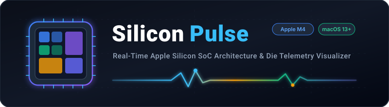
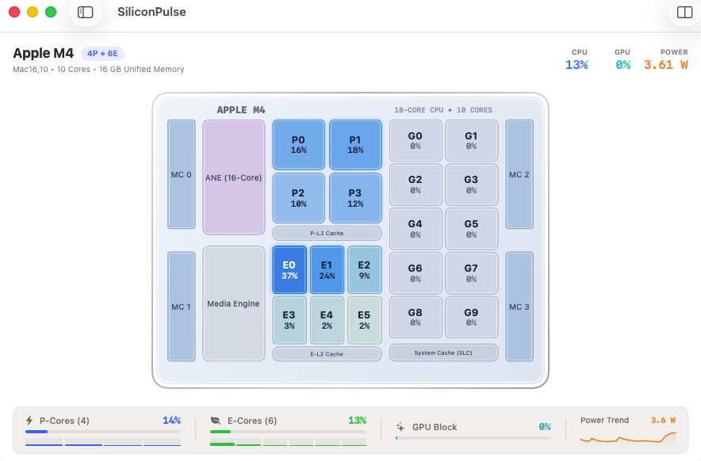
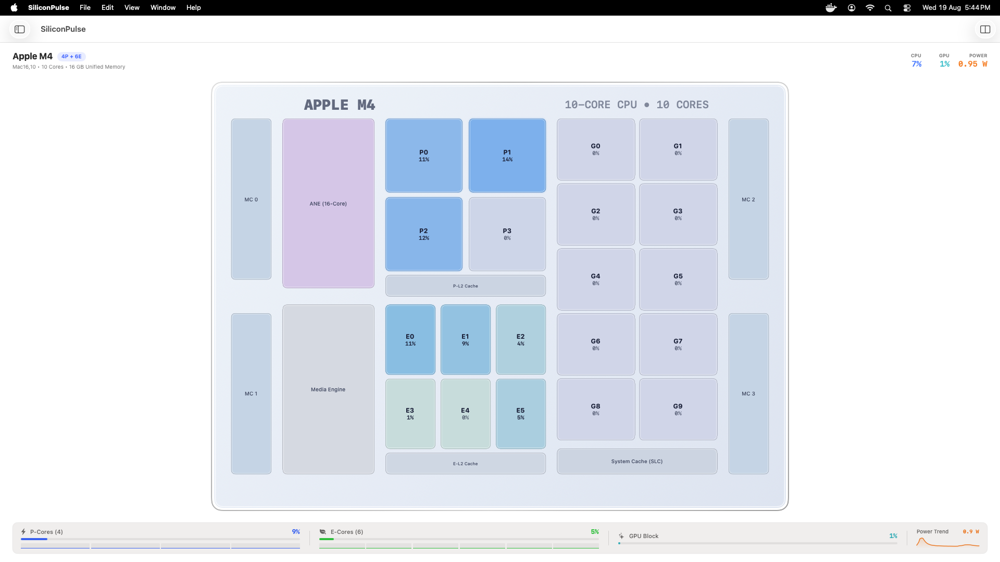

<div align="center">



# SiliconPulse ⚡️
### Real-Time Apple Silicon SoC Architecture & Die Telemetry Visualizer for macOS

[](https://apple.com)
[](https://apple.com)
[](https://swift.org)
[](LICENSE)
[](https://github.com/rajeshc-git/silicon-pulse/releases)

<p align="center">
  <b>SiliconPulse</b> brings your Apple Silicon System-on-Chip (SoC) to life. Watch live CPU cores, GPU clusters, Apple Neural Engine (ANE), cache subsystems, and power draw animate dynamically directly on an interactive chip floorplan.
</p>

[**Download DMG (v1.0.0)**](https://github.com/rajeshc-git/silicon-pulse/releases/tag/v1.0.0) • [**Report Bug**](https://github.com/rajeshc-git/silicon-pulse/issues) • [**Request Chip Support**](https://github.com/rajeshc-git/silicon-pulse/issues) • [**Architecture**](docs/ARCHITECTURE.md)

---

</div>

## 📸 Screenshots & Interface Previews

### 🖥️ Native Windowed Mode
<div align="center">
  
  <p><i>Live Apple M4 (4P + 6E, 10 Cores, 16GB UMA) floorplan with real-time per-core load percentages, GPU EUs, ANE, and power sparkline.</i></p>
</div>

<br/>

### 🌌 Fullscreen Die Monitoring View
<div align="center">
  
  <p><i>Expanded dashboard view with comprehensive telemetry bars, sub-millisecond core activity tracking, and power history.</i></p>
</div>

---

## ✨ Key Features

- 🔬 **Interactive SoC Floorplan**: Accurate visual representation of Apple Silicon die topology (Performance Cores, Efficiency Cores, GPU Execution Units, Neural Engine, Media Engine, Cache, and Memory Controllers).
- ⚡️ **Per-Core Precision**: Real-time load indicators for every individual core (`P0`..`P3`+, `E0`..`E5`+, `G0`..`G9`+).
- 🧠 **Neural Engine & Media Engine Telemetry**: Monitor duty cycles on the 16-core Apple Neural Engine (ANE) and hardware video acceleration engines.
- 📈 **Real-Time Power & Wattage Trend**: Live package power consumption (`W`) sparkline tracking dynamic power fluctuations.
- 🪶 **Ultra-Low Overhead**: Native Swift & SwiftUI telemetry loop sampling kernel stats with `< 0.5%` CPU utilization.
- 🎨 **macOS Native Aesthetics**: Smooth glassmorphic design supporting macOS Light and Dark appearance seamlessly.

---

## 💻 Supported Apple Silicon Matrix

SiliconPulse supports all modern Apple Silicon hardware generations:

| Chip Family | Identifiers | Configurations | Floorplan Map |
| :--- | :--- | :--- | :---: |
| **Apple M4 / Pro / Max** | `Mac16,x` | 10-Core / 14-Core / 16-Core (4P+6E, etc.) | ✅ Active |
| **Apple M3 / Pro / Max** | `Mac15,x` | 8-Core / 12-Core / 16-Core | ✅ Active |
| **Apple M2 / Pro / Max / Ultra** | `Mac14,x` | 8-Core up to 24-Core | ✅ Active |
| **Apple M1 / Pro / Max / Ultra** | `MacBookPro18,x`, `Mac13,x`, etc. | 8-Core up to 20-Core | ✅ Active |

*See [`docs/CHIP_SUPPORT.md`](docs/CHIP_SUPPORT.md) for detailed die maps and specs.*

---

## 🚀 Installation & Quick Start

### 1. Download Release DMG (Recommended)
1. Download the latest **[SiliconPulse-v1.0.0.dmg](https://github.com/rajeshc-git/silicon-pulse/releases/download/v1.0.0/SiliconPulse-v1.0.0.dmg)**.
2. Open the `.dmg` file.
3. Drag **SiliconPulse.app** into your `/Applications` folder.

### 2. Homebrew Cask
```bash
brew install --cask rajeshc-git/tap/silicon-pulse
```

### 3. Build from Source
```bash
# Clone the repository
git clone https://github.com/rajeshc-git/silicon-pulse.git
cd silicon-pulse

# Build release binary
swift build -c release
```

---

## 🛠 Project Structure

```
silicon-pulse/
├── assets/
│   ├── branding/           # SVG logo & banner assets
│   └── screenshots/        # High-res windowed & fullscreen preview images
├── Casks/
│   └── silicon-pulse.rb    # Homebrew Cask formula
├── docs/
│   ├── ARCHITECTURE.md     # Kernel sampling & rendering pipeline internals
│   └── CHIP_SUPPORT.md     # SoC topology specs across M1–M4 generations
├── scripts/
│   └── build_dmg.sh        # Automated DMG packaging script
├── CHANGELOG.md            # Version release history
├── CONTRIBUTING.md         # Open source contribution guide
├── CODE_OF_CONDUCT.md     # Contributor Covenant standard
├── LICENSE                 # MIT License
├── README.md               # Main repository documentation
└── SECURITY.md             # Security policy & reporting
```

---

## 🤝 Contributing

We love open source contributions! Whether you want to add new SoC layouts, optimize telemetry routines, or refine UI animations, check out our [Contributing Guide](CONTRIBUTING.md) to get started.

---

## 📄 License

This project is licensed under the **MIT License** - see the [LICENSE](LICENSE) file for details.

---

<div align="center">
  <sub>Engineered with ❤️ for the Apple Silicon & Mac Open Source Community by <a href="https://github.com/rajeshc-git">Rajesh Chandrasekar</a></sub>
</div>
