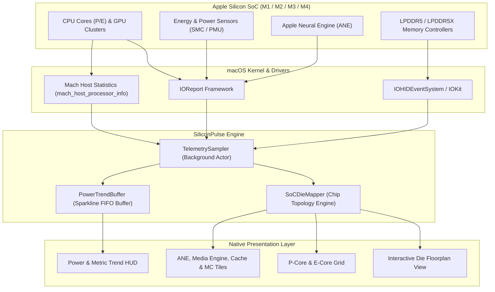

# SiliconPulse Architecture & Internals 🏛️

**SiliconPulse** is built from the ground up as a native, lightweight, zero-dependency macOS application engineered to visualize real-time Apple Silicon System-on-Chip (SoC) telemetry.

---

## 🧭 System Pipeline Overview

The following diagram illustrates how telemetry data flows from the Apple Silicon hardware registers into the interactive visual floorplan:

---

## 🔍 Core Subsystems

### 1. Telemetry Sampling Subsystem (`TelemetrySampler`)
- **IOReport Framework**: Subscribes to private Apple Silicon telemetry channels for CPU energy, GPU residency, ANE duty cycles, and memory bandwidth.
- **Mach Host Processor Info**: Direct kernel call `host_processor_info()` with `PROCESSOR_CPU_LOAD_INFO` to obtain per-core tick deltas (User, System, Idle, Nice) without launching external processes.
- **Low Overhead**: Operates on a dedicated background Swift `actor` with configurable polling rates (default: 500ms – 1000ms), consuming less than 0.5% CPU resources.

### 2. SoC Topology & Die Mapping Engine (`SoCDieMapper`)
- Inspects system identifiers (`sysctl hw.model`, `sysctl machdep.cpu.brand_string`, and core configuration registers).
- Resolves chip topology:
  - Ratio of Performance cores vs. Efficiency cores (e.g. 4P + 6E on standard Apple M4).
  - Number of GPU Execution Units / Cores.
  - Neural Engine core count and Media Engine configuration.
  - Multi-channel memory controllers (MC 0 through MC 3/7/15).
  - System Level Cache (SLC) and L2 clusters.
- Normalizes active load percentages into dynamic color fills, pulse glows, and responsive SVG/Canvas tiles.

### 3. Power Estimation & Trend Buffer
- Calculates instantaneous package power in Watts (`W`).
- Maintains an in-memory rolling FIFO buffer of power and load history.
- Renders smooth Bézier sparkline curves dynamically via SwiftUI `Path`.

### 4. Native SwiftUI Presentation Layer
- Fully hardware-accelerated rendering utilizing Metal and CoreGraphics under the hood.
- Responsive layout engine supporting compact windowed view and spacious fullscreen displays.
- Automatic dynamic color palette shifting matching macOS Dark and Light system appearances.
